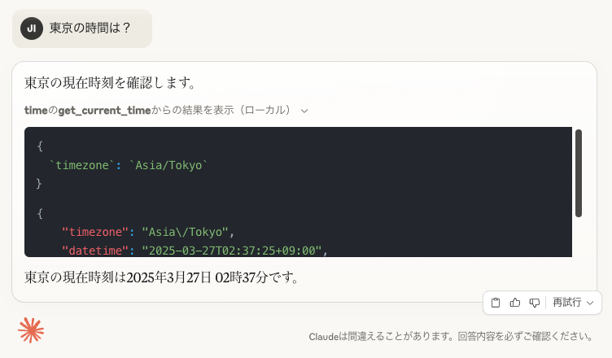

# Time MCP Server by PHP

PHPで実装されたMCP(モデルコンテキストプロトコルサーバー)で、時刻とタイムゾーン変換機能を提供します。

このサーバーは、LLMがIANAタイムゾーン名を使用して現在の時刻情報を取得し、タイムゾーン変換を実行できるようにし、システムタイムゾーンを自動検出します。



## 利用可能なツール

- `get_current_time` - 特定のタイムゾーンまたはシステムタイムゾーンでの現在時刻を取得します。
  - 必須引数:
    - `timezone` (文字列): IANAタイムゾーン名（例: 'America/New_York'、'Europe/London'）

- `convert_time` - タイムゾーン間で時刻を変換します。
  - 必須引数:
    - `source_timezone` (文字列): 元のIANAタイムゾーン名
    - `time` (文字列): 24時間形式（HH:MM）の時間
    - `target_timezone` (文字列): 変換先のIANAタイムゾーン名

## インストール

```bash
# 本レポジトリをclone
$ git clone https://github.com/uzulla/mcp-time-php.git

# Composerでインストールした場合
$ cd mcp-time-php
$ composer install
```

## MCP利用側の設定

### Claude.appの設定

<details>
<summary>PHPを直接実行で使用</summary>

```json
"mcpServers": {
  "time": {
    "command": "php",
    "args": ["/path/to/this/repo/bin/time-server"]
  }
}
```
</details>

### Zedの設定

Zedのsettings.jsonに追加：

<details>
<summary>PHPを使用</summary>

```json
"context_servers": {
  "mcp-server-time": {
    "command": "php",
    "args": ["/path/to/this/repo/bin/time-server"]
  }
},
```
</details>

### カスタマイズ - システムタイムゾーン

デフォルトでは、サーバーはシステムのタイムゾーンを自動的に検出します。設定の`args`リストに引数`--local-timezone`を追加することで、これをオーバーライドできます。

例：
```json
{
  "command": "php",
  "args": ["/path/to/this/repo/bin/time-server", "--local-timezone=America/New_York"]
}
```

## 対話例

1. 現在時刻の取得：
```json
{
  "name": "get_current_time",
  "arguments": {
    "timezone": "Europe/Warsaw"
  }
}
```
レスポンス：
```json
{
  "timezone": "Europe/Warsaw",
  "datetime": "2024-01-01T13:00:00+01:00",
  "is_dst": false
}
```

2. タイムゾーン間の時間変換：
```json
{
  "name": "convert_time",
  "arguments": {
    "source_timezone": "America/New_York",
    "time": "16:30",
    "target_timezone": "Asia/Tokyo"
  }
}
```
レスポンス：
```json
{
  "source": {
    "timezone": "America/New_York",
    "datetime": "2024-01-01T16:30:00-05:00",
    "is_dst": false
  },
  "target": {
    "timezone": "Asia/Tokyo",
    "datetime": "2024-01-02T06:30:00+09:00",
    "is_dst": false
  },
  "time_difference": "+14.0h"
}
```

## デバッグ

MCPインスペクターを使用してサーバーをデバッグできます：

```bash
npx @modelcontextprotocol/inspector ./bin/time-server
```

## 開発

### プロジェクト構造

```
.
├── bin/                   # 実行可能スクリプト
│   └── time-server        # エントリーポイント
├── src/                   # ソースコード
│   ├── Enum/              # 列挙型クラス
│   │   └── TimeTools.php  # 時間関連ツール列挙型
│   ├── Model/             # データモデル
│   │   ├── TimeConversionResult.php  # 時間変換結果モデル
│   │   └── TimeResult.php  # 時間取得結果モデル
│   ├── Service/           # サービスクラス
│   │   ├── TimeService.php  # 時間サービス
│   │   └── TimeUtils.php  # 時間ユーティリティ
│   └── StdioServer.php    # MCPサーバー実装
├── tests/                 # テストコード
│   ├── ServerTest.php     # サーバーテスト
│   └── TimeServerTest.php # 時間サーバーテスト
├── composer.json          # Composer設定
├── composer.lock          # Composerロックファイル
├── phpunit.xml            # PHPUnit設定
└── README.md              # このファイル
```

### テスト

Composerをインストールして依存関係をセットアップします：

```bash
composer install
```

PHPUnitテストを実行します：

```bash
composer test
```

## Claudeへの質問例

1. 「今何時ですか？」（システムタイムゾーンを使用）
2. 「東京の時間は？」
3. 「ニューヨークで午後4時の時、ロンドンでは何時ですか？」
4. 「東京時間の午前9時30分をニューヨーク時間に変換して」

## License

This project is licensed under the MIT License.

MIT License

Copyright (c) 2025 Junichi Ishida aka uzulla (zishida@gmail.com)

Permission is hereby granted, free of charge, to any person obtaining a copy of this software and associated documentation files (the “Software”), to deal in the Software without restriction, including without limitation the rights to use, copy, modify, merge, publish, distribute, sublicense, and/or sell copies of the Software, and to permit persons to whom the Software is furnished to do so, subject to the following conditions:

The above copyright notice and this permission notice shall be included in all copies or substantial portions of the Software.

THE SOFTWARE IS PROVIDED “AS IS”, WITHOUT WARRANTY OF ANY KIND, EXPRESS OR IMPLIED, INCLUDING BUT NOT LIMITED TO THE WARRANTIES OF MERCHANTABILITY, FITNESS FOR A PARTICULAR PURPOSE AND NONINFRINGEMENT. IN no event shall the authors or copyright holders be liable for any claim, damages or other liability, whether in an action of contract, tort or otherwise, arising from, out of or in connection with the software or the use or other dealings in the Software.

Acknowledgments

This project incorporates and translates portions of the following open-source projects:
- [Model Context Protocol Servers (MIT License)](https://github.com/modelcontextprotocol/servers) 
- [Model Context Protocol Python SDK (MIT License)](https://github.com/modelcontextprotocol/python-sdk)

